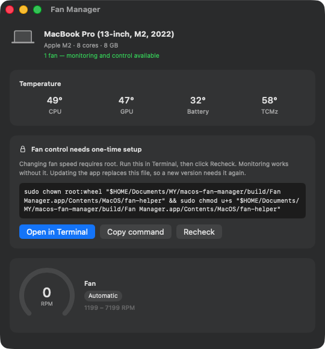
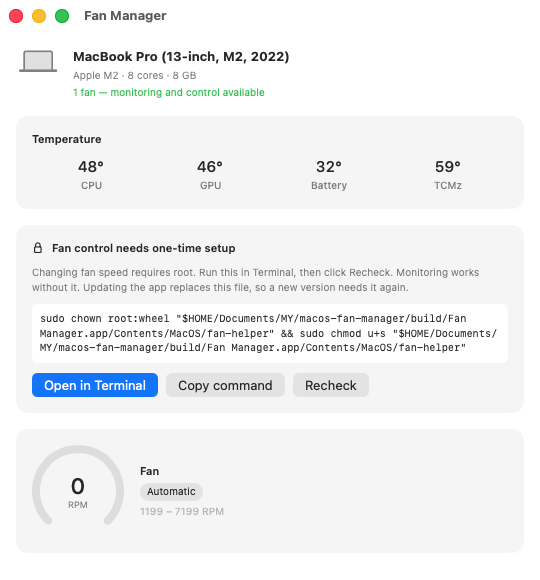
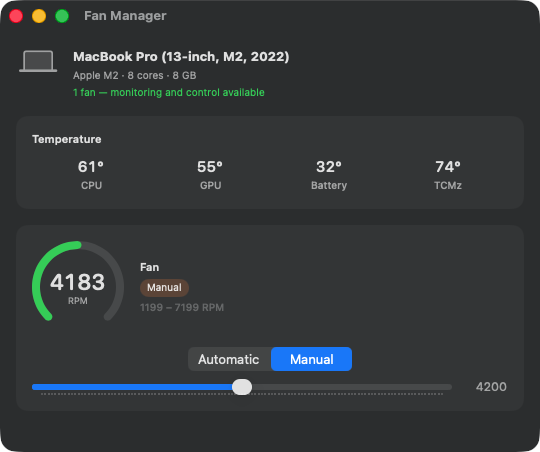
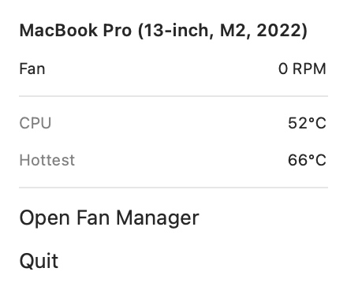
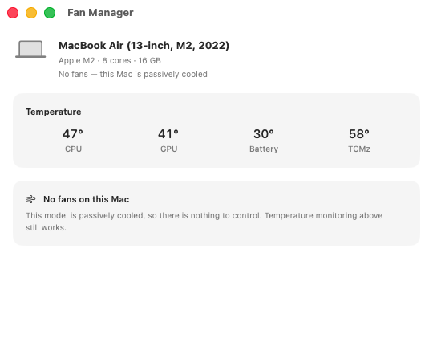
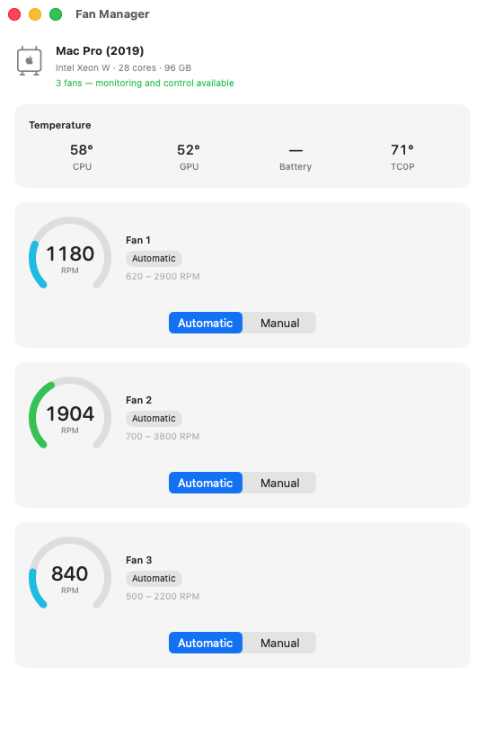
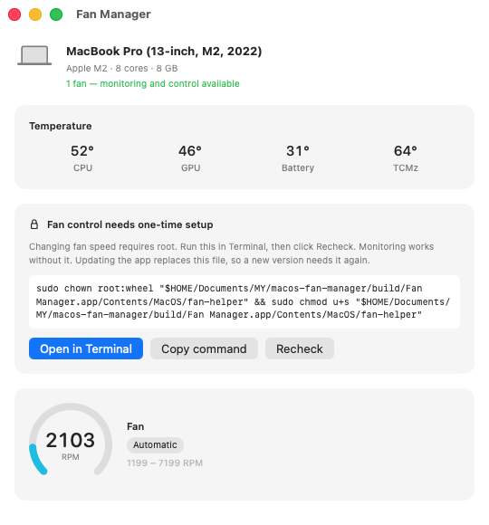

<div align="center">


# Fan Manager

**Fan monitoring and control for macOS.**

Reads the SMC directly over IOKit — no kexts, no daemon, no dependencies.
Download, unzip, run.

<a href="../../releases/latest/download/FanManager.zip"></a>

<sub>macOS 13 or later · Intel and Apple Silicon · MIT ·
<a href="../../releases">all releases</a></sub>



</div>

---

## Download and run

### The short version

[**Download FanManager.zip**](../../releases/latest/download/FanManager.zip),
unzip it, drag the app to `/Applications`, then run this once so macOS will open
it:

```sh
xattr -dr com.apple.quarantine "/Applications/Fan Manager.app"
```

Or do all of that in one command:

```sh
curl -fsSL https://raw.githubusercontent.com/emhasala/macos-fan-manager/main/install.sh | bash
```

The installer downloads the latest release, checks its SHA-256 against the
published checksum, installs to `/Applications`, and clears the quarantine flag.
It never asks for your password and never enables fan control — that stays a
separate step you take yourself. `--uninstall` reverses it.

Piping a script from the internet into `bash` is a habit worth being suspicious
of, including here. [Read it first](install.sh) — it is about a hundred lines —
or use the manual steps below, which do exactly the same thing.

### The longer version

**1. Download.** [`FanManager.zip`](../../releases/latest/download/FanManager.zip)
from the latest release.

**2. Unzip and move it.** Double-click the zip, then drag **Fan Manager.app**
wherever you want it — `/Applications`, your Desktop, a USB stick. There is no
installer and nothing is written outside the app itself.

**3. Clear the quarantine flag.** These builds are ad-hoc signed but *not
notarized*, because notarization requires a paid Apple Developer account. macOS
quarantines anything downloaded from the internet, so the first launch is
blocked with "Fan Manager is damaged" or "cannot be opened". Run this once:

```sh
xattr -dr com.apple.quarantine "/Applications/Fan Manager.app"
```

Adjust the path if you put the app somewhere else.

**4. Open it.** Double-click. Fan speeds and temperatures appear immediately,
and an RPM readout appears in your menu bar. **No password, no setup.**

**5. Only if you want to change fan speeds**, see
[Enabling fan control](#enabling-fan-control) below. Monitoring never needs it.

> Prefer not to trust a binary you didn't build?
> [Build it from source](#building-from-source) — about a minute, and no Xcode.
>
> Uninstalling: drag the app to the Trash, or run `./install.sh --uninstall`.

## What it looks like

<table>
<tr>
<td width="50%" align="center">
<br>
<sub><b>Automatic</b> — macOS is in charge, the app just watches.</sub>
</td>
<td width="50%" align="center">
<br>
<sub><b>Manual</b> — pinned to a fixed RPM you choose.</sub>
</td>
</tr>
</table>

<div align="center">

<br>
<sub>Live RPM and temperatures in the menu bar, without opening the window.</sub>
</div>

## Every Mac, including the ones with nothing to control

The app asks the hardware what it has instead of matching a list of models, so
it behaves correctly on machines that did not exist when it was written. Fan
count comes from the SMC's own `FNum`, and controllability from the write
attribute the firmware reports for each control key.

<table>
<tr>
<td width="50%" align="center">
<br>
<sub><b>Fanless Macs</b> — every M-series MacBook Air. Temperatures still work,
and the app says plainly there is nothing to control rather than erroring.</sub>
</td>
<td width="50%" align="center">
<br>
<sub><b>Multi-fan desktops</b> — iMac, Mac Pro, Mac Studio. Every fan gets its
own card, gauge and range.</sub>
</td>
</tr>
</table>

| Machine | Behaviour |
|---|---|
| MacBook Pro | Full monitoring and control |
| iMac, Mac mini, Mac Studio, Mac Pro | Full monitoring and control, one card per fan |
| Intel MacBook Air (2020 and earlier) | Full monitoring and control — these do have fans |
| M-series MacBook Air | Temperatures only — these are fanless |
| Firmware that refuses writes | Monitoring only, clearly labelled |

> The fanless and multi-fan images above are the real app driven by fixed
> hardware values (`--preview`), since this project is developed on a
> single-fan MacBook Pro. Same views, same code — only the numbers are stated
> rather than measured.

## Enabling fan control

Changing a fan speed requires root, and macOS offers no way around that.
**This app will never ask for your password or escalate its own privileges.**

<div align="center">

</div>

Click **Open in Terminal** and the app opens a Terminal window running a script
that prints the command, then runs it. `sudo` asks for your password there, in
front of you. Or click **Copy command** and paste it yourself:

```sh
sudo chown root:wheel "/Applications/Fan Manager.app/Contents/MacOS/fan-helper"
sudo chmod u+s "/Applications/Fan Manager.app/Contents/MacOS/fan-helper"
```

Then click **Recheck** and the controls appear.

Updating the app replaces `fan-helper`, and a new binary does not inherit the
setuid bit — so **fan control needs enabling again after every update**. The app
notices and shows the setup card again rather than failing quietly.

To turn it back off:

```sh
sudo chmod u-s "/Applications/Fan Manager.app/Contents/MacOS/fan-helper"
```

### Why it's done this way

A setuid root binary is a privilege boundary, so `fan-helper` is written like
one. It is about a hundred lines, accepts four fixed verbs, parses nothing but
an integer and a float, never reads its environment, never spawns a process,
and clamps every RPM to the range the firmware itself reports. The worst it can
be made to do is set a legal fan speed.

Showing the command rather than running it behind a silent auth prompt is
deliberate. Anyone downloading a fan control binary off the internet should be
able to see exactly what gains root, and when.

## Safety

Forcing a fan sets `F0Md = 1` and a target RPM, which takes that fan off the
macOS thermal curve. The SMC keeps that setting after the app exits. **A fan
forced *low* under sustained load will overheat the machine.**

- Quitting the app releases every fan *this app* forced — and only those.
- Overrides are also recorded under `~/Library/Application Support/FanManager/`
  and released on next launch. `applicationWillTerminate` covers a normal quit
  and nothing else — not a crash, not Force Quit, not `SIGKILL` — so the
  on-disk record is what actually protects a machine whose fan control app died
  holding a fan.
- `fanctl set` holds the foreground and restores on every exit path, `SIGINT`
  and `SIGTERM` included.
- Every RPM is clamped to the firmware's own min/max before it is written.

Raising a fan's speed is safe. Lowering it below the automatic curve is how
people cook laptops.

## Command line

`fanctl` ships inside the bundle at `Fan Manager.app/Contents/MacOS/fanctl`.

```
fanctl info          this Mac, and what it supports
fanctl list          fan count and per-fan RPM
fanctl watch         live-updating fan table
fanctl temps         temperature sensors
fanctl keys          dump every SMC key with its decoded value
fanctl read <KEY>    read one key, e.g. F0Ac
fanctl set <rpm>     force a fan to a fixed RPM (root; holds until Ctrl-C)
fanctl set auto      return the fan to macOS control
```

Everything except `set` is read-only and needs no privileges.

```
$ fanctl info
MacBook Pro (13-inch, M2, 2022)
  model     Mac14,7
  chip      Apple M2 (Apple Silicon)
  cores     8
  memory    8 GB
  cooling   1 fan — monitoring and control available
```

## Building from source

Requires Swift 5.9+. **Xcode is not needed** — the Command Line Tools are
enough, which is why there is no `.xcodeproj` in this repo.

```sh
git clone https://github.com/<you>/macos-fan-manager
cd macos-fan-manager

./Scripts/build-app.sh          # -> build/Fan Manager.app
open "build/Fan Manager.app"
```

A local build is not quarantined, so step 3 above does not apply.

| Script | Does |
|---|---|
| `Scripts/build-app.sh` | Builds the universal `.app` |
| `Scripts/package.sh` | Builds the release zip |
| `Scripts/make-icon.swift` | Draws `AppIcon.icns` with Core Graphics |
| `Scripts/make-docs.sh` | Regenerates the icon and every screenshot here |
| `install.sh` | Downloads, verifies and installs a release |

`swift build --arch arm64 --arch x86_64` needs XCBuild, which ships only with
full Xcode, so `build-app.sh` builds each slice against its own triple and
`lipo`s them together. Same universal binary, no Xcode.

## How it works

```
Fan Manager.app  ──────────────┐
  SwiftUI, unprivileged        │ reads
  MenuBarExtra + window        ▼
                          AppleSMC  (IOKit)
  fan-helper  ─────────────────▲
  setuid root, ~100 lines      │ writes
```

SMC keys are four-character codes: `FNum` is the fan count, `F0Ac` fan 0's
actual RPM, `F0Mn`/`F0Mx` its limits, `F0Tg` the target, `F0Md` the mode.
Values arrive as `flt`, `fpe2`, `ui8` and friends, so every read is decoded by
the type the firmware reports rather than by assumption.

### Four things that will bite you

If you are writing your own SMC code, these cost the most time.

**`SMCKeyData` must be exactly 80 bytes.** Swift packs a struct's trailing
padding differently from C: `SMCKeyInfoData` is 9 bytes with 3 bytes of tail
padding, and Swift places the *next* field into that padding where C does not,
silently producing a 76-byte struct the SMC rejects. The padding is spelled out
explicitly here, and `SMC.init` asserts the size rather than trusting it.

**Attribute bit `0x02` is not "writable".** It is *private read*. The write flag
is `0x40`. Checking the wrong bit makes every key on the machine look read-only.

**`F0Md = 1` does not mean the user took over.** On Apple Silicon, macOS drives
the fans by setting the mode bit and a target itself — observed here with the
fan pinned at a 1949 RPM target that this project had never written to. The mode
bit only says *somebody* is steering the fan, never who. An app that infers a
manual override from it reports the OS's own cooling as user control, so this
app tracks the overrides it has issued instead.

**Publishing from an AppKit callback rebuilds the view you are standing in.**
Not SMC-specific, but it crashes hardware-control UIs in particular. A slider's
`onEditingChanged` runs inside AppKit mouse tracking; mutating an
`ObservableObject` there makes SwiftUI apply the update *synchronously*, tearing
down the calling view. Any `@State` written afterwards writes through a dead
pointer — `EXC_BAD_ACCESS` in `State.wrappedValue.setter`. Control actions here
are `async` so the mutation lands on the next main-actor turn, and per-fan error
text lives on the monitor rather than in the card's `@State`.

## Layout

```
Sources/SMCKit/          SMC.swift, Device.swift, Sensors.swift
Sources/FanManagerApp/   SwiftUI app
Sources/FanHelper/       the only code that runs as root
Sources/fanctl/          command line interface
Scripts/                 build, package, icon and screenshot tooling
docs/                    generated icon and screenshots
```

The icon and every screenshot here are generated rather than checked in by
hand: `make-icon.swift` draws the icon with Core Graphics, and the screenshots
come from the app itself — `ImageRenderer` for the menu bar panel, real window
captures for the dashboards, because `ImageRenderer` draws AppKit-backed
controls like sliders as placeholders.

## Licence

MIT — see [LICENSE](LICENSE).
